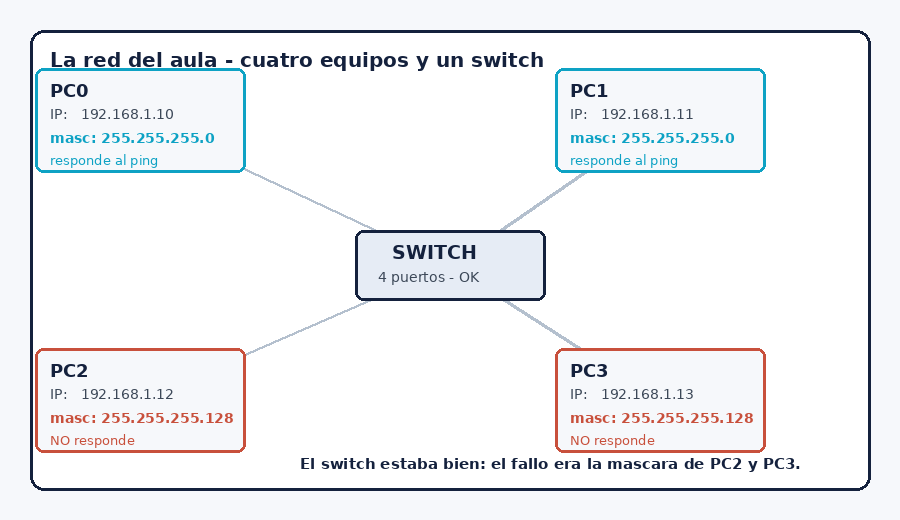

# Primer trimestre

## Cómo se añade una entrada

Copia este bloque, pégalo aquí abajo y rellénalo. **La entrada más reciente va arriba del todo.**

```
### Nombre de la actividad — fecha

**Qué era:** una línea, para acordarte dentro de seis meses.
**Qué he entregado:** el nombre del archivo que subiste a Teams.
**Herramienta:** con qué lo hiciste.
**Dónde me atasqué:** una o dos líneas. Esta es la importante.
**Truco que me apunto:** lo que harías distinto la próxima vez.


```

Máximo diez líneas por entrada. No copies el enunciado ni repitas lo que ya va en la entrega.

---

### La red que no funcionaba — 27/10

> Esta entrada es el ejemplo que hicimos en clase. Cuando tengas las tuyas, puedes borrarla.

**Qué era:** arreglar una red de cuatro equipos que no se veían entre sí, en Packet Tracer.
**Qué he entregado:** U1_A5_Red_Lucia.pka
**Herramienta:** Packet Tracer
**Dónde me atasqué:** en la máscara. Estuve veinte minutos cambiando IPs al azar porque estaba convencido de que el fallo era del switch.
**Truco que me apunto:** antes de tocar nada, hacer ping a todos y apuntar en una tabla qué responde. Al verlo escrito, el fallo canta.


